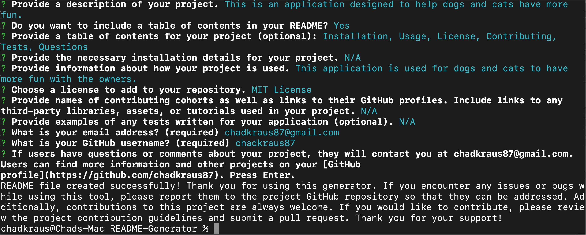

# README Generator

## Description

This application is designed to help users create and generate high-quality README files via command line prompts. With this README Generator application, users no longer need to spend hours crafting a well-written README file from scratch. The tool streamlines the process by offering a series of command line prompts that guide users through the creation of a README file. These prompts cover all the important sections that a professional README file should include, such as project description, installation instructions, usage examples, contributing guidelines, and more.

[GitHub Repository](https://github.com/chadkraus87/README-Generator)

]
(https://drive.google.com/file/d/1EIou1pHfQXtrZwFtBjIfQI2E9xsScndt/view)

## Table of Contents

- [Installation](#installation)
- [Usage](#usage)
- [License](#license)
- [Contributing](#contributing)
- [Tests](#tests)
- [Questions](#questions)

## Installation

The NPM Inquirer.js package is required to run this application. To install the package, please visit [NPM Inquirer.js documentation](https://www.npmjs.com/package/inquirer).

## Usage

To simplify the README generation process, you can use this application to save you time and produce documentation for your projects. To get started, simply run the application in your terminal using the command "node index.js" and follow the prompts to provide information about your project. The generator will automatically create a README file for you, complete with sections for a project description, installation instructions, usage examples, and more. Thank you for using our tool, and happy coding!

## License

This project is licensed under the MIT License license.

## Contributing

[NPM Inquirer Package](https://www.npmjs.com/package/inquirer)

[Professional README Guide](https://coding-boot-camp.github.io/full-stack/github/professional-readme-guide)

[Video Submission Guide](https://coding-boot-camp.github.io/full-stack/computer-literacy/video-submission-guide)

[Screencastify](https://www.screencastify.com/)

[README Shields](https://shields.io/)

[Node.js](https://nodejs.org/en/docs)

## Tests

N/A

## Questions

If you have any questions or comments about this project, please contact me at chadkraus87@gmail.com. You can also find more information and other projects on my GitHub https://github.com/chadkraus87. If you encounter any issues or bugs while using this tool, please report them to the project GitHub repository so that they can be addressed. Additionally, contributions to this project are always welcome. If you would like to contribute, please review the project contribution guidelines and submit a pull request. Thank you for your support!
